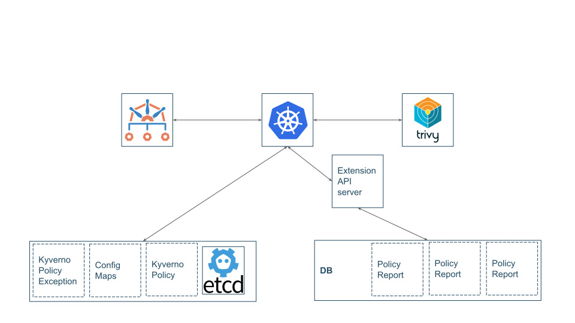

# Meta
[meta]: #meta
- Name: Alternative Report Storage
- Start Date: 2023-10-10
- Update Date (optional): 2023-10-10
- Author(s): @stone-z
- Supersedes: N/A

# Table of Contents
[table-of-contents]: #table-of-contents
- [Meta](#meta)
- [Table of Contents](#table-of-contents)
- [Overview](#overview)
- [Definitions](#definitions)
- [Motivation](#motivation)
- [Proposal](#proposal)
- [Implementation](#implementation)
- [Migration (OPTIONAL)](#migration-optional)
- [Drawbacks](#drawbacks)
- [Alternatives](#alternatives)
- [Prior Art](#prior-art)
- [Unresolved Questions](#unresolved-questions)
- [CRD Changes (OPTIONAL)](#crd-changes-optional)

# Overview
[overview]: #overview

This component (still in need of a succinct, catchy name) allows users to configure an alternative storage location for WG Policy `PolicyReports` and, ideally, other types of report resources created by Kyverno and other producers of PolicyReport CRs. The suggested implementation side-steps current limitations of the Kubernetes API server by introducing an extension API server, which is configured through the Kubernetes aggregation API to handle requests for report resources instead of the standard Kubernetes API server.

It is not a feature of Kyverno itself, but a separate system which would support future reporting efforts by Kyverno and other report producers and consumers.

# Definitions
[definitions]: #definitions

Make a list of the definitions that may be useful for those reviewing. Include phrases and words that Kyverno users or other interested parties may not be familiar with.

- CR - Custom Resource
- CRD - Custom Resource Definition
- PolicyReport - A specific CRD designed by the Policy working group to store policy compliance information.
- other report types - used throughout to refer to other CRDs besides PolicyReports which would similarly benefit from being removed from etcd and stored in an alternative database
- etcd - the underlying storage used by the Kubernetes API server to store cluster resources.
- kine - ["Kine is not etcd"](https://github.com/k3s-io/kine) - a shim that translates etcd API requests to equivalent relational database queries. In doing so, Kine allows storing Kubernetes resources in non-etcd databases.
- CAP - Consistency, Availability, Partition tolerance - three properties of data availability of which, according to the CAP theorem, a distributed system can only deliver two. etcd is a distributed data store which prioritizes consistency and partition tolerance.
- Aggregation API - The [Kubernetes Aggregation API](https://kubernetes.io/docs/concepts/extend-kubernetes/api-extension/apiserver-aggregation/) allows the Kubernetes API server to serve requests for non-Kubernetes APIs, by proxying those requests to external services.
- extension API server - An instance of the external services to which the Kubernetes API can proxy requests. An extension API server is a component / pod which responds to requests for non-Kubernetes native or CRD types.

For brevity, the rest of this KDP will simply use "reports" to collectively refer to WG Policy types (`PolicyReport`), all current and future Kyverno-internal report types (`AdmissionReport`, `BackgroundReport`), as well as other unspecified, implementation-specific internal report types which would also benefit from storage outside etcd.

# Motivation
[motivation]: #motivation

- Why should we do this?
- What use cases does it support?
- What is the expected outcome?

This KDP arises out of several discussions about limitations of the Kubernetes API server in storing and using report data.

It is desirable to move reports out of etcd for several reasons:

Why leave etcd:

- The etcd database currently has a maximum size of 8GB. Reports tend to be relatively large objects, but even with very small reports, the etcd capacity can be easily reached in larger clusters with many report producers.
- Under heavy report activity (e.g. cluster churn, scanning, analytical processes, etc.), the volume of data being written and retrieved by etcd requires the API server to buffer large amounts of data. This compounds existing cluster issues and can cascade into complete API unavailability.
- CAP guarantees are not required for reports, which, at present, are understood to be ephemeral data which will be re-created if deleted.
- Philosophically, report data is analytical in nature and should not be stored in the transactional database.
- These are also the arguments for [removing Kubernetes `Events` from the primary etcd](https://github.com/kubernetes/kubernetes/issues/4432) as well. This issue has not yet been fully resolved.

Expected benefits of alternative storage:

- Alleviation of the etcd + API server load and capacity limitations.
- Common report consumer workflows can be more efficient.
    - Report consumers are often analytical in nature and/or operate on aggregate data. The API is not designed to efficiently handle, for example, a query for all reports where containing a vulnerability with a CVSS severity of 8.0 or above. To perform such a query, a report consumer must retrieve and parse all of the reports. Retrieving a large volume of reports, especially with multiple simultaneous consumers, leads to the performance issues described previously.
    - With reports stored in, for instance, a relational database, report consumers could instead query the underlying database directly, using more robust query syntax.
    - This would improve the implementation of, or even replace the need for, certain exporters, and enable new reporting use cases.

Kyverno is not the only user of these reports, but is well-positioned to manage such a feature as a (if not the) primary producer and driving force behind their adoption.

# Proposal

This provides a high level overview of the feature.

- Define any new terminology.
- Explaining the feature largely in terms of examples.
- If applicable, provide sample error messages, deprecation warnings, or migration guidance.
- If applicable, describe the differences between teaching this to existing users and new users.

The high-level proposal is to introduce a new component which is managed through the aggregation API and serves report requests using an alternative database.

The diagram below shows a sample high-level view of a cluster with the new component installed:

# Implementation

This is the technical portion of the KDP, where you explain the design in sufficient detail.

The section should return to the examples given in the previous section, and explain more fully how the detailed proposal makes those examples work.

The implementation presented here makes the assumption that, if anything, the hypothetically most likely next step for official Kubernetes API server support for additional storage would be to expand the existing alternative etcd path configuration to support optional instances and allow configuring CRDs to be optionally stored in their own etcd instances (as has been done for Events, and https://github.com/kubernetes/kubernetes/issues/118858).
It also assumes that keeping an etcd-compatible interface will make development easier, versus needing to also generate new client libraries and adapters.

Based on those assumptions, this sample implementation suggests using `kine` as an intermediary between the extension API server and the database.
This has the following advantages:

1. If, in the future, official in-tree support for optional external etcd instances for reports is added, the extension API server could simply be removed and the Kubernetes API server configured to use the existing `kine` instance to store reports.
2. `kine` already supports multiple database options.
3. Existing clients and code which expects an etcd interface can continue to operate on reports without translation. The extension API server can effectively serve as a proxy.
4. It is a CNCF incubating project and already used in k3s, so has community support and governance.

The known or possible downsides to using `kine` are:

1. it is an additional level of indirection from the API server which introduces latency and the possibility for failure. Extension API servers must reply to the request within a limited amount of time.
2. it likely constrains the query behavior _through the Kubernetes API_ in the same way as the current implementation (this requires investigation). However, consumers could still query the underlying database directly, bypassing `kine`.

## Possible Implementation Details

## Link to the Implementation PR

# Migration (OPTIONAL)

This section should document breaks to public API and breaks in compatibility due to this KDP's proposed changes. In addition, it should document the proposed steps that one would need to take to work through these changes.

Assuming report data to be ephemeral, migration would not be strictly necessary. Removing the report CRDs would delete any reports in etcd, and registering the extension API server in the aggregation layer would result in any new report operations to be handled by the new components.

If truly necessary, existing report data could be synchronized from etcd during installation. This implementation has not yet been investigated.

# Drawbacks

Why should we **not** do this?

- The use cases which require bypassing the API server become "shadow" operations from an audit logging and potentially resource lifecycle perspective. It is technically possible for a client directly using the database to modify an object. It is unclear whether this modification would be propagated by `kine` back to watching controllers. If the modification _is_ published to resource subscribers, it is possible that some tooling which directly modifies the database can compete with cluster controllers. For this reason, it is suggested that modification to report resources be done only through the API, and direct database connections be read-only (aside from `kine`).
- This approach increases the complexity and failure potential for report operations, and introduces new security considerations like database access control and audit logging.

# Alternatives

- What other designs have been considered?
- Why is this proposal the best?
- What is the impact of not doing this?

Several alternatives have been considered and presented in the contributors' meeting and WG Policy, including:

- using a separate etcd - even with API server support for storing custom resources in an external etcd like that used for Events, the additional etcd instances are expected to be present when the API server starts, otherwise the API server panics. This makes it more difficult to bootstrap a cluster or add the capability later during the cluster's lifecycle.
- changing the structure / reducing the size of `PolicyReports` - it would be possible to store, for example, only a minimal reference to a full report stored elsewhere. This doesn't negate the need for the alternative storage, but still suffers from the same maximum size limitation. Even with very small reports, there remains a theoretical cap on the number of them which can be generated inside a cluster.
- report consumers and producers can implement storage in an alternative database outside the Kubernetes API. This would require significant coordination among the various tool maintainers, and also eliminates the benefits of having the reports accessible through the API.
- attempting an in-tree solution - while the theoretically perfect solution, such a change would be a huge endeavor. Additionally, the same issue has been long-standing for Events, recently revived for CRDs, and remains unsolved. Implementing alternative resource storage in a relational database directly would be a huge API machinery change.

# Prior Art

Discuss prior art, both the good and bad.

# Unresolved Questions

- What parts of the design do you expect to be resolved before this gets merged?
- What parts of the design do you expect to be resolved through implementation of the feature?
- What related issues do you consider out of scope for this KDP that could be addressed in the future independently of the solution that comes out of this KDP?

# CRD Changes (OPTIONAL)

Does this KDP entail any proposed changes to the core CRD or any extensions? If so, please document changes here.
