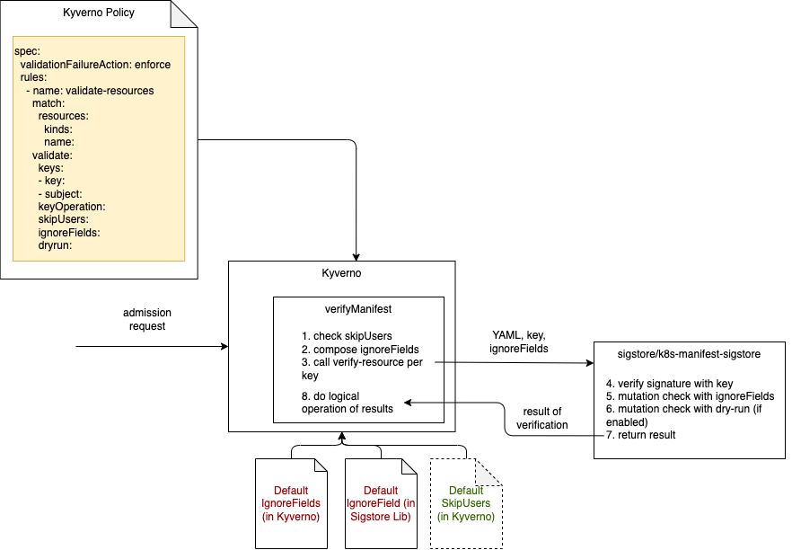

# YAML Signing & Verification 

Name: YAML signing and verification \
Start Date: 2021-12-25 \
Authors: [Namanl2001](https://github.com/Namanl2001), [JimBugwadia](https://github.com/JimBugwadia), [yuji-watanabe-jp](https://github.com/yuji-watanabe-jp), [rurikudo](https://github.com/rurikudo)\
Supersedes: N/A

## Overview

This proposal adds support for verifying the integrity and source of a Kubernetes resource using cosign signatures and a Kyverno policy.

## Motivation

For certain Kubernetes resources, like central policies applied across multiple clusters, it is important to ensure that the resources can be trusted, and that any attempts to tamper with the resource  definition is blocked.  

Signatures are commonly used to verify origin and content of critical resources. For example, container image signing is used to verify the source and integrity of images.

This feature uses signatures to sign resource declarations via Cosign, and verify the integrity of the resource using Kyverno.

## Proposal

The proposal is to support the sigstore [k8s-manifest CLI](https://github.com/sigstore/k8s-manifest-sigstore)  for signing YAMLs using the option to embed the signature into the YAML declaration:

Here is an example of signing an nginx pod using a static key:

```
 kubectl sigstore sign -f nginx-pod.yaml  --key cosign.key
```

This produces a `nginx-pod.yaml.signed` declaration that looks like this:

```
 apiVersion: v1
kind: Pod
metadata:
  annotations:
    cosign.sigstore.dev/message: H4sIAAAAAAAA/wAzAcz+H4sIAAAAAAAA/+ySPU/DMBCGM+dXnLqH2v2IW6/sKANiP5IjMjg+y3YLBfHfUdwKmEB0qZDyLCf7PT/+kOdp8POWBx8oRuP6KmGo+tdlLWW9larezl1v3Evlubs64GCLMxBCCLVej1WqtfheM0u1KuRK1lJJpepFIRZCrZYFiHM2+yu7mDAUQjya4ce+3/LTXT7rPwG9uaMQDTsNe1k+GddpaLgrB0rYYUJdAqBznDAZdlHD23sJYPGebBwzALSWn6uOLCWKGmYPaCPNSgCHA2nw3FX5D5XRUzsuadklNI5CFlRgBuxJQ27SFhPFlMV5vtlZ27A17UHDDe0p5OioPmrHseeQTsepvvwNh6RhIzYiJwA+cOKWrYbb66a89NtPTExMXJKPAAAA//+lixZxAAgAAAEAAP//QYqwEDMBAAA=
    cosign.sigstore.dev/signature: MEQCIGJ9cjguB6TXcMGCDyWyCRyVOb6YOrHDo6S4VtZGuvVjAiA1qm5N/koj94I4JtL5BywhuBVxS7VpEkGLtcwIkVDogg==
  labels:
    allow-deletes: "false"
  name: pod-nginx
spec:
  containers:
  - image: nginx:latest
    imagePullPolicy: Never
    name: nginx
    ports:
    - containerPort: 8080
      protocol: TCP

```

This declaration can then be verified by a Kyverno policy rule. This policy checks that all pods are signed using a static key:

```
---
apiVersion: kyverno.io/v1
kind: ClusterPolicy
metadata:
  name: check-signatures
spec:
  rules:
    - name: check-manifest
      match:
        resources:
          kinds:
            - Pod
      validate:
        manifests:
          - key: |-
            -----BEGIN PUBLIC KEY-----
                      ...
            -----END PUBLIC KEY-----
```

This option of signing and verifying YAMLs is compatible with GitOps workflows and does not require an OCI registry to store signed resource definitions.

## Implementation

Although referred to as “YAML signing” this feature may be more accurately described as verifying the integrity of a Kubernetes manifest or resource declaration. YAML is used as a canonical format during signing and verification.

Since Kubernetes resources are typically mutated during admission controls by native and 3rd party controllers, this feature needs to be able to allow certain mutations, and ignore them during serialization and verification. 

There are two approaches to handle the defaults and other mutations:

1. Allow users to specify an `ignoreFields` in the policy: this is useful when there are few changes in the resource manifest, and and most changes are isolated to the `status` element. The drawback of this approach is that each field needs to be maintained in the policy.

2. Use the API sever `dry-run` feature: this is useful when there are several changes made for defaults and by controllers to the resource. For example, a pod has several fields across its `spec` and `status` elements that get modified over its lifecycle. The drawback of this approach is that Kyverno needs permissions to create the resource via a `dry-run`. 

## Requirements

1. Kyverno should support a new `validate.manifests` declaration to allow verifying a YAML has been signed by one or more signatures.
2. The declaration must support a list of keys and allow logical AND / OR operations to allow signing by at least one of the keys for key rotation, a minimum count of keys, and multiple keys e.g. team and group level.  
3. A Kyverno policy rule for YAML verification should automatically allow (i.e. ignore) mutations performed by “trusted” controllers such as Kubernetes controllers and  Kyverno mutate rules.  


## Drawbacks

* Each resource needs to be signed vs. creating a resource bundle for a set of resources.
* Calculating the canonical form of the resource requires a “dry-run” to eliminate changes made based on defaults and other admission controllers.
* Performing a dry-run create requires Kyverno to have permissions to create the resource.

## Known Implementations

The Stolstron project Contains OpenShift/OKD compatibility projects for Open Cluster Management. Stolostron Integrity Shield provides:

* Signing and verification with GPG, X.509 certificates, and Sigstore cosign
* An admission controller with custom policy resources [ManifestIntegrityConstraint ](https://github.com/stolostron/integrity-shield/blob/master/docs/README_GETTING-STARTED-TUTORIAL.md#create-a-sample-manifestintegrityconstraint)and [ManifestIntegrityState](https://github.com/stolostron/integrity-shield/blob/master/docs/README_GETTING-STARTED-TUTORIAL.md#check-the-resource-integrity-status-from-the-manifestintegritystate-generated-by-observer).
* An Gatekeeper/OPA extension
* An operator

More information at: [https://github.com/stolostron/integrity-shield#integrity-shield](https://github.com/stolostron/integrity-shield#integrity-shield) 


# Alternatives

## Signed OCI Bundle

Kyverno policies can be stored in an OCI registry and signed as an OCI bundle. This feature is proposed in a separate KDP:

    https://github.com/kyverno/KDP/pull/19

Using an OCI registry, with Kyverno support for policy bundles, can enable a model where policies are applied in-memory and do not get exposed as resources in the cluster. This has security advantages.

However, the OCI approach may not work well with GitOps-style workflows, where policies are managed centrally in a Git repository. Also, the YAML signing approach supports a broader set of use cases, beyond policy resources.

The two approaches both seem like good features to support, and do not negate the need for each other.


## Integrate Integrity Shield library with Kyverno

An alternative to directly using the Sigstore [k8s-manifest-sigstore](https://github.com/sigstore/k8s-manifest-sigstore) library is to integrate with the IntegrityShield library.

This gist provides an implementation:

[https://gist.github.com/rurikudo/60a537ee25ca9134decbce248491c669](https://gist.github.com/rurikudo/60a537ee25ca9134decbce248491c669)

### Benefits

1. Support for GPG and X.509, in addition to Cosign signatures.
2. out-of-the-box support for [skipping users](https://github.com/stolostron/integrity-shield/blob/c8b478ab69e00080df5d9ec528e5fd529859e1c2/shield/resource/manifest-verify-config.yaml#L64-L223)  (e.g. replicaset-controller service account for Pods)
3. manifest verification with "dry-run & compare" which provides robust matching against mutation of manifests.

### Drawbacks

1. An additional layer of dependency will be introduced for Kyverno, which will introduce coupling across the projects. 
2. Support for skipping users and objects may be better controlled in the policy declarations rather than internals. If it’s best to implicitly handle, or some combination of implicit vs explicit control is required, Kyverno’s match / exclude function can be leveraged.
3. The “dry-run & compare” can be reused from the Sigstore implementation. It needs to be determined, if this is required for all resources or if users should be able to control its usage via policy.
4. There are a number of IBM and OpenShift references in the Stolstrom code which may not be applicable to Kyverno. For example, the default skip users.
5. We want to avoid any disk operations in kyverno and keep it read only. But sigstore requires file-system access to process the encrypted message and signature added to the metadata, after signing a manifest. To deal with this in kyverno we are trying to perform all the required tasks in-memory.


# Recommended Design

## Use a YAML subset as canonical format with k8s-manifest-sigstore

This would be similar to what is currently done via the sigstore Kubectl plugin ([https://github.com/sigstore/k8s-manifest-sigstore](https://github.com/sigstore/k8s-manifest-sigstore)). The plugin supports two options:

1. Store YAML signatures and digest in an OCI registry
2. Store YAML signature and digest in the YAML itself

The priority would be to investigate the 2nd option.Resources to test with 

* Unit tests 
* Testing with various resourceTypes done
* Use sigstore’s default-ignoreFields
* Added kyverno specific default ignoreFields
* Test with various resourceTypes again
* documentation

## Use k8s-manifest-sigstore to verify YAML signature



Kyverno Policy CRDs (Kyverno `Policy` and `ClusterPolicy`) is extended to include
- `validate.manifests` declaration, which includes
  - `keys`
    - `key`
    - `subject`
  - `keyOperation`
  - `ignoreFields` 
  - `skipUsers`
  - `resourceBundleRef`
  - `annotationDomain`
  - `dryrun`
    - `namespace`
    - `enabled`


See the detail of this CRD extension ==> https://github.com/rurikudo/kyverno/blob/dev/yaml-signing-sigstore/config/crds/kyverno.io_clusterpolicies.yaml


With this extension, `validate.manifests` declaration supports new features below. 
- supports a list of keys ([example](https://gist.github.com/rurikudo/e92f7db0f10bcd2b5e8891b7f5ec0a75#1-supports-a-list-of-keys))
- supports multiple signatures on a same YAML manifest ([example](https://gist.github.com/rurikudo/e92f7db0f10bcd2b5e8891b7f5ec0a75#2-supports-multiple-signatures-on-a-same-yaml-manifest))
- supports logical AND/OR operations for keys ([example](https://gist.github.com/rurikudo/e92f7db0f10bcd2b5e8891b7f5ec0a75#3-supports-logical-andor-operations-for-keys))
- supports allow mutation by trusted controllers (kubernetes controller and kyverno mutate rules)([example](https://gist.github.com/rurikudo/e92f7db0f10bcd2b5e8891b7f5ec0a75#4-supports-allow-mutation-by-trusted-controllers))
- support two types of signing each resource or creating a resource bundle ([example](https://gist.github.com/rurikudo/e92f7db0f10bcd2b5e8891b7f5ec0a75#5-support-two-types-of-signing-each-resource-or-creating-a-resource-bundle))
- support keyless signing (experimental feature) ([example](https://gist.github.com/rurikudo/e92f7db0f10bcd2b5e8891b7f5ec0a75#6-support-keyless-signing-experimental-feature))
- use both sigstore's default ignoreFields and Kyverno specific default ignoreFields 
- support dry-run mode to eliminate changes made based on defaults and other admission controllers. (This requires Kyverno to have [additional permission to create the resources](https://github.com/rurikudo/kyverno/blob/dev/yaml-signing-sigstore/config/dryrun/dryrun_rbac.yaml).) ([example](https://gist.github.com/rurikudo/e92f7db0f10bcd2b5e8891b7f5ec0a75#7-support-dry-run-mode))

|  Property  |  Description | Required | Default |
| ---- | ---- | ---- | --- | 
|  keys               | list of public keys or signer's subjects   | yes |  |
|  keyOperation       | logic operation for keys ('MustAll' or 'AtLeastOne')  | no | 'AtLeastOne' |
|  ignoreFields       | list of fields in which mutation is allowed | no |  [] |
|  skipUsers          | list of trusted users or service accounts  | no | [] |
|  resourceBundleRef  | OCI path for resource bundle which includes the YAML manifest | no | '' | 
|  annotationDomain   | domain used for signature annotation | no | 'cosign.sigstore.dev' |
|  dryrun             | configuration to enable dryrun | no | enabled = false | 


Kyverno can verify YAML manifest using k8s-manifest-sigstore directly. The verifyManifest function of Kyverno verifies the YAML signature by the following steps. 
- check skipUsers
- compose ignoreFields configuration to be considered.
- verify yaml signature by calling verify-resource function in k8s-manifest-sigstore iteratively per key
  - verify-resource function in k8s-manifest-sigstore takes yaml manifest, public key, and ignoreFields as inputs, and does the signature verification. 
    - check if the signature is valid
    - apply ignoreField configuration
    - do mutation filtering with dryrun if enabled
    - return the result of validation. 

- compose the result from verify-resource according to the logical operation specified in KeyOperation.


We have conducted prototype with the latest code in Kyverno [main branch](https://github.com/kyverno/kyverno/commit/008b9ab48e4cb9d7749f0cc11510527f4cdaed4b) and verified the all the requirements documented here can be demonstrated with the [implementation](https://github.com/rurikudo/kyverno/tree/dev/yaml-signing-sigstore). 


The prototype code ==> https://github.com/rurikudo/kyverno/tree/dev/yaml-signing-sigstore

The following resource types are tested in both dry-run disabled mode(default) and enabled mode. The detailed test results including policy and sample data are documented [here](https://github.com/rurikudo/kyverno-ishield-library-example). 

- ClusterRole
- ClusterRoleBinding
- ConfigMap
- Deployment
- Pod
- Role
- RoleBinding
- Secret
- Service
- ServiceAccount
- ClusterPolicy
- Policy


# References

* [GitHub - sigstore/k8s-manifest-sigstore: kubectl plugin for signing Kubernetes manifest YAML files with sigstore](https://github.com/sigstore/k8s-manifest-sigstore)
* [https://sigstore.slack.com/archives/C01DGF0G8U9/p1625691042453400?thread_ts=1625651994.446200&cid=C01DGF0G8U9](https://sigstore.slack.com/archives/C01DGF0G8U9/p1625691042453400?thread_ts=1625651994.446200&cid=C01DGF0G8U9)
* [GitHub - IBM/integrity-shield: Integrity Shield is a tool for built-in preventive integrity control for regulated cloud workloads. It includes signature based configuration drift prevention based on Admission Webhook on Kubernetes cluster.](https://github.com/IBM/integrity-shield)